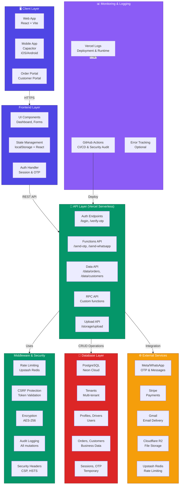
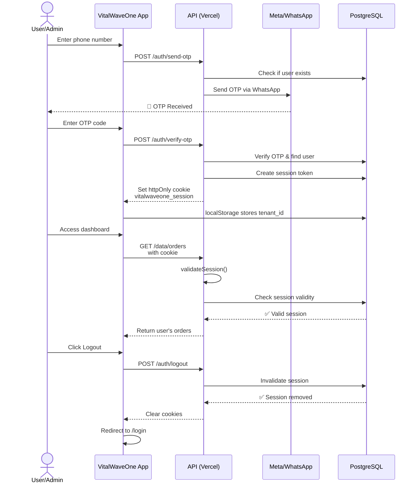
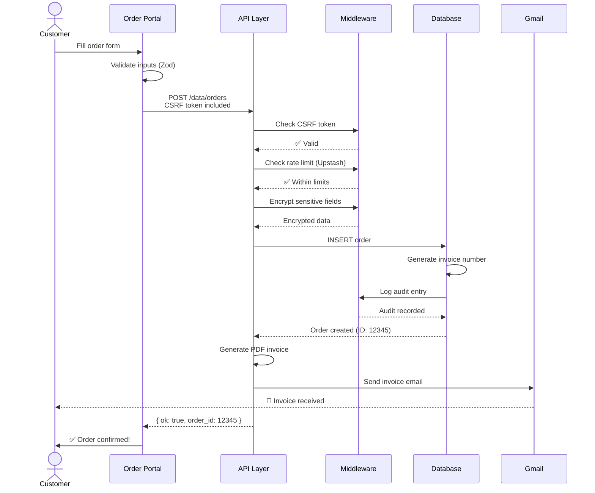
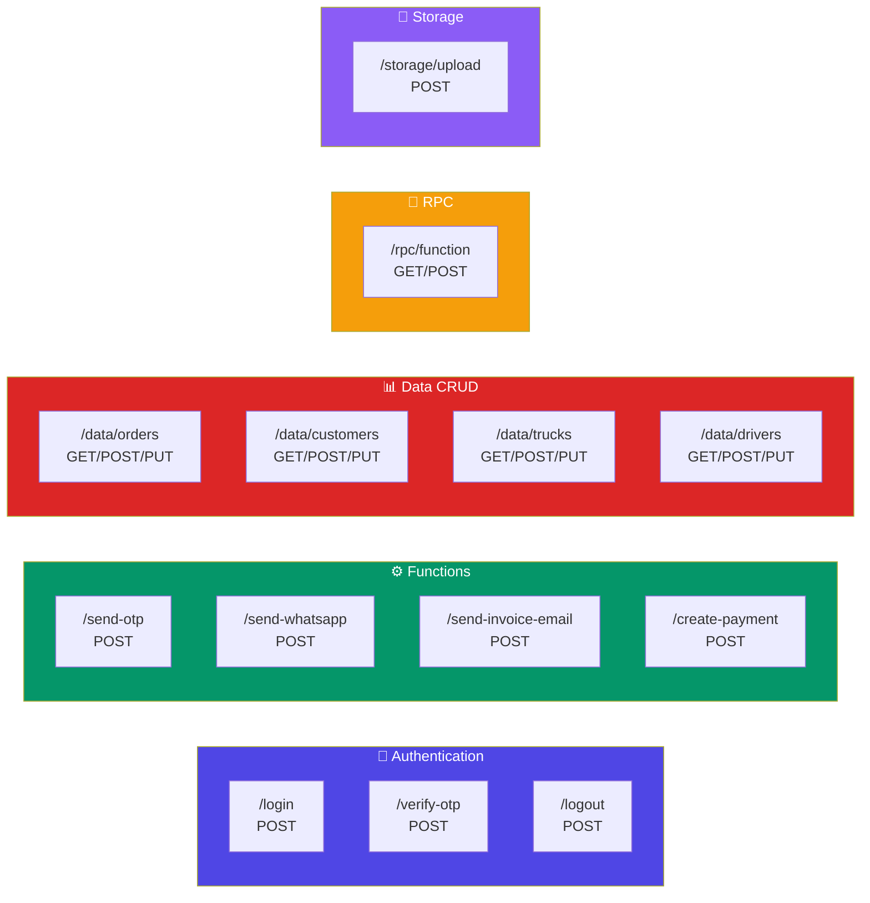
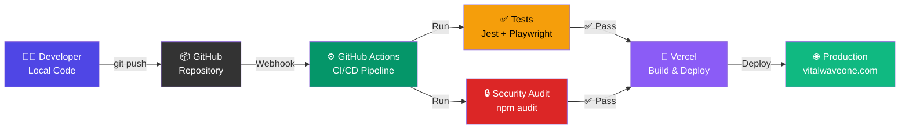
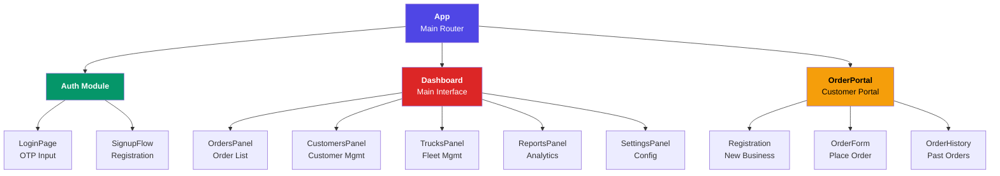
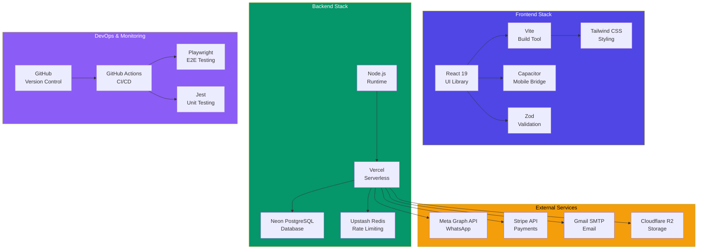
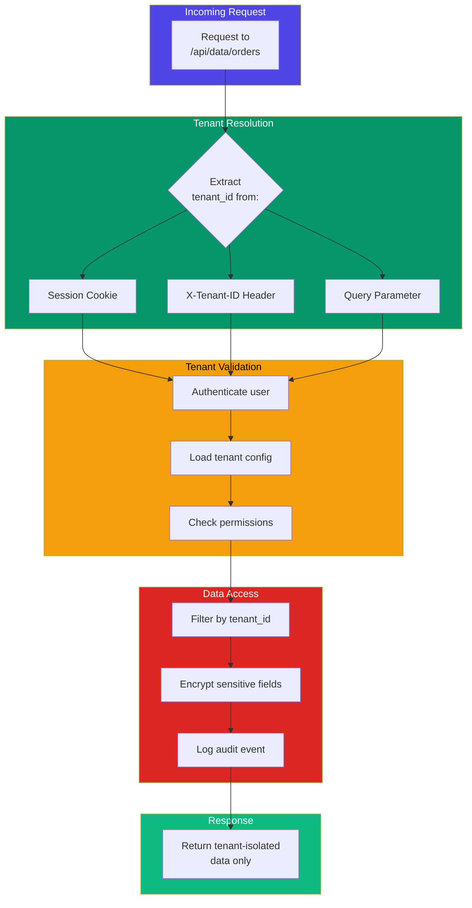

# VitalWaveOne Architecture & UML Diagrams

## 1. System Architecture Overview



---

## 2. Database Schema (ER Diagram)

```mermaid
erDiagram
    TENANTS ||--o{ PROFILES : has
    TENANTS ||--o{ ORDERS : has
    TENANTS ||--o{ CUSTOMERS : has
    TENANTS ||--o{ TRUCKS : has
    TENANTS ||--o{ DRIVERS : has
    TENANTS ||--o{ COMPANY : has
    TENANTS ||--o{ INVOICE_SEQUENCES : has
    
    PROFILES ||--o{ SESSIONS : has
    DRIVERS ||--o{ SESSIONS : has
    
    ORDERS ||--o{ ORDER_ITEMS : contains
    CUSTOMERS ||--o{ ORDERS : places
    TRUCKS ||--o{ ROUTE_ASSIGNMENTS : assigned_to
    
    AUDIT_LOGS ||--o{ TENANTS : logs_for
    OTP_CODES ||--o{ PROFILES : sent_to
    CSRF_TOKENS ||--o{ SESSIONS : protects

    TENANTS {
        int id PK
        string name
        string slug UK
        string plan
        string status
        timestamp trial_ends_at
        int max_trucks
        int max_customers
    }

    PROFILES {
        int id PK
        int tenant_id FK
        string email
        string phone UK
        string full_name
        string role
        boolean is_active
    }

    DRIVERS {
        int id PK
        int tenant_id FK
        string name
        string phone UK
        string vehicle_number
        boolean is_active
    }

    CUSTOMERS {
        int id PK
        int tenant_id FK
        string business_name
        string contact_person
        string phone
        string email
        string address
        jsonb encrypted_fields
    }

    ORDERS {
        int id PK
        int tenant_id FK
        int customer_id FK
        int truck_id FK
        string status
        decimal total_amount
        timestamp created_at
        timestamp delivered_at
    }

    ORDER_ITEMS {
        int id PK
        int order_id FK
        string product_id
        int quantity
        decimal unit_price
    }

    SESSIONS {
        int id PK
        string token UK
        int user_id FK
        string user_type
        int tenant_id FK
        boolean is_active
        timestamp expires_at
    }

    COMPANY {
        int id PK
        int tenant_id FK UK
        string meta_phone_id
        string meta_token
        string gmail_user
        string gmail_app_password
    }

    AUDIT_LOGS {
        int id PK
        int tenant_id FK
        int user_id FK
        string action
        jsonb changes
        jsonb metadata
        timestamp created_at
    }

    OTP_CODES {
        int id PK
        string phone
        string code UK
        boolean used
        timestamp expires_at
        timestamp created_at
    }

    CSRF_TOKENS {
        int id PK
        int session_id FK UK
        string token UK
        timestamp expires_at
    }

    INVOICE_SEQUENCES {
        int id PK
        int tenant_id FK UK
        int current_number
    }

    TRUCKS {
        int id PK
        int tenant_id FK
        string vehicle_number
        string driver_id FK
        string status
    }

    ROUTE_ASSIGNMENTS {
        int id PK
        int truck_id FK
        int driver_id FK
        date assigned_date
        string route
    }
```

---

## 3. Authentication & Authorization Flow



---

## 4. Data Flow: Order Creation



---

## 5. API Endpoint Map



---

## 6. Security Layers

```mermaid
graph TB
    subgraph Layers["Security Layers (Top to Bottom)"]
        L1["🔒 Layer 1: Transport Security<br/>HTTPS + TLS 1.3 + HSTS"]
        L2["🔒 Layer 2: Content Security<br/>CSP Headers + X-Frame-Options"]
        L3["🔒 Layer 3: Authentication<br/>WhatsApp OTP + Session Tokens"]
        L4["🔒 Layer 4: Authorization<br/>Tenant Isolation + Role Checks"]
        L5["🔒 Layer 5: API Protection<br/>CSRF Tokens + Rate Limiting"]
        L6["🔒 Layer 6: Data Protection<br/>AES-256 Encryption + Audit Logs"]
        L7["🔒 Layer 7: Input Validation<br/>Zod Schema Validation"]
        L8["🔒 Layer 8: Error Handling<br/>No sensitive data in errors"]
    end

    L1 --> L2
    L2 --> L3
    L3 --> L4
    L4 --> L5
    L5 --> L6
    L6 --> L7
    L7 --> L8

    style L1 fill:#DC2626,color:#fff
    style L2 fill:#EA580C,color:#fff
    style L3 fill:#EAB308,color:#000
    style L4 fill:#84CC16,color:#000
    style L5 fill:#22C55E,color:#fff
    style L6 fill:#10B981,color:#fff
    style L7 fill:#06B6D4,color:#fff
    style L8 fill:#0EA5E9,color:#fff
```



---

## 7. Deployment Pipeline



---

## 8. Component Hierarchy



---

## 9. Technology Stack



---

## 10. Multi-Tenant Architecture



---

## Summary

- **Architecture**: Modern, serverless, multi-tenant SaaS
- **Security**: 8-layer defense with encryption, audit logs, rate limiting
- **Scalability**: Serverless backend scales automatically
- **Database**: PostgreSQL with Neon cloud for reliability
- **API**: RESTful with CSRF protection and rate limiting
- **Frontend**: React + Vite with responsive design
- **Mobile**: Capacitor for iOS/Android distribution
- **DevOps**: Automated CI/CD with GitHub Actions & Vercel

