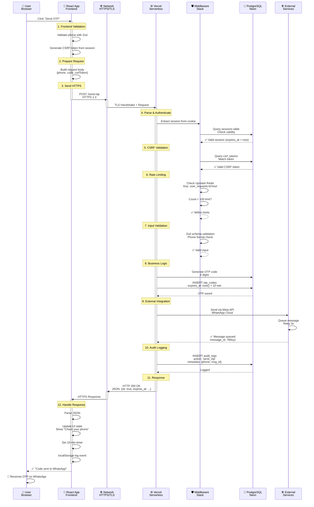
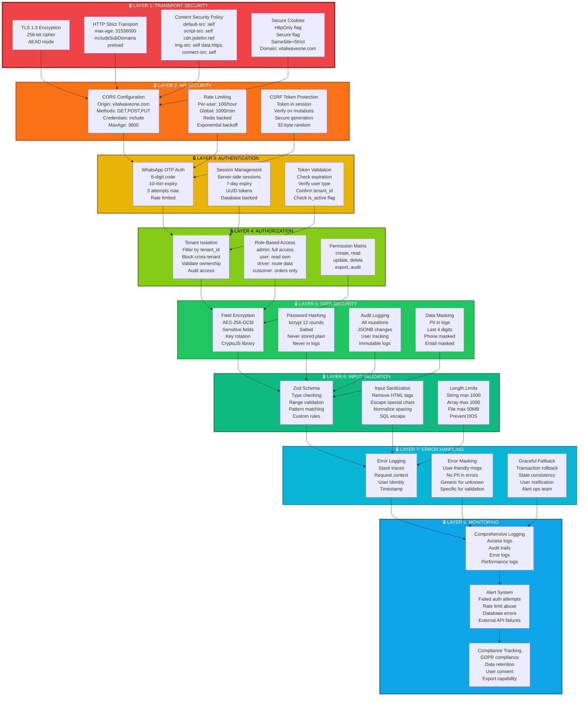
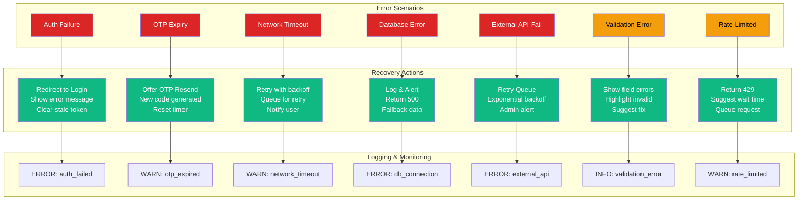
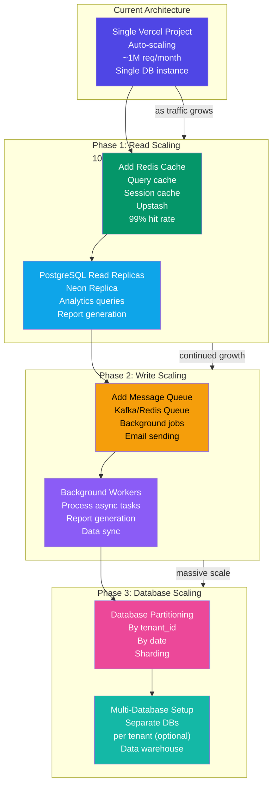
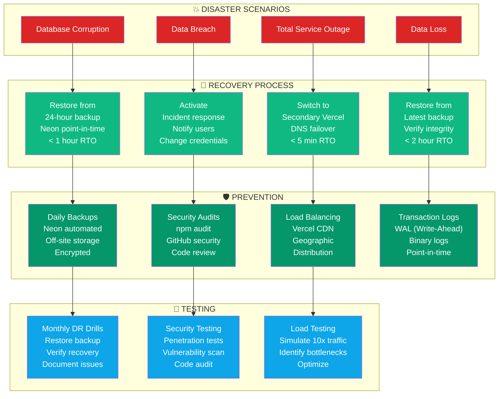
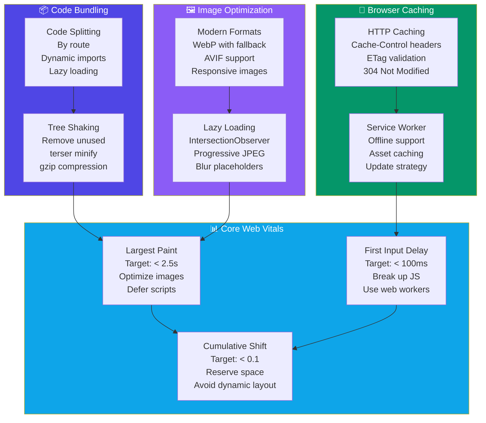

# VitalWaveOne - Complete UML & Architecture Diagrams with Detailed Specifications

---

# SECTION 1: DETAILED SYSTEM ARCHITECTURE

## 1.1 Complete System Architecture with Data Flow

```mermaid
graph TB
    subgraph Client["👥 CLIENT LAYER"]
        Web["🌐 Web App<br/>React 19 + Vite<br/>Code Splitting<br/>Lazy Loading"]
        Mobile["📱 Mobile App<br/>Capacitor<br/>iOS & Android<br/>Native Bridge"]
        Portal["🛒 Order Portal<br/>Customer Ordering<br/>Order History<br/>Invoice Download"]
    end

    subgraph Frontend["🎨 FRONTEND LAYER (React)"]
        Router["React Router<br/>Navigation<br/>Page Management"]
        State["State Management<br/>useState/useReducer<br/>localStorage<br/>Session Storage"]
        Components["UI Components<br/>Forms, Tables<br/>Charts, Modals<br/>Real-time Updates"]
        Validation["Input Validation<br/>Zod Schema<br/>Field Validation<br/>Error Handling"]
        Auth["Auth Module<br/>Session Manager<br/>Token Handler<br/>Permission Check"]
    end

    subgraph API["🔌 API LAYER (Vercel Serverless)"]
        AuthAPI["Auth Endpoints<br/>POST /auth/login<br/>POST /auth/verify-otp<br/>POST /auth/logout<br/>CORS: vitalwaveone.com"]
        
        DataAPI["Data Endpoints<br/>GET /data/orders<br/>GET /data/customers<br/>POST /data/orders<br/>PUT /data/trucks<br/>DELETE /data/drivers"]
        
        FnAPI["Function Endpoints<br/>POST /send-otp<br/>POST /send-whatsapp<br/>POST /send-invoice-email<br/>POST /create-payment<br/>POST /send-invoice-sms"]
        
        RpcAPI["RPC Endpoints<br/>POST /rpc/function<br/>Custom Operations<br/>Batch Processing"]
        
        FileAPI["Storage Endpoints<br/>POST /storage/upload<br/>GET /storage/file<br/>DELETE /storage/file<br/>R2 Integration"]
    end

    subgraph Middleware["🛡️ MIDDLEWARE & SECURITY"]
        Auth_Middleware["Authentication<br/>Extract session token<br/>Validate JWT<br/>Check expiration<br/>Attach user context"]
        
        RateLimit["Rate Limiting<br/>Per-user: 100 req/hr<br/>Global: 1000 req/min<br/>Upstash Redis<br/>Exponential backoff"]
        
        CSRF["CSRF Protection<br/>Token in session<br/>Verify on mutations<br/>Secure httpOnly<br/>SameSite=Strict"]
        
        Encryption["Data Encryption<br/>AES-256-GCM<br/>Sensitive fields<br/>Key rotation ready<br/>CryptoJS library"]
        
        Validation["Input Validation<br/>Zod schema<br/>Type checking<br/>Range validation<br/>SQL injection prevention"]
        
        AuditLog["Audit Logging<br/>All mutations logged<br/>JSONB changes<br/>User tracking<br/>90-day retention"]
        
        SecurityHeaders["Security Headers<br/>CSP: strict<br/>HSTS: 1 year<br/>X-Frame: DENY<br/>X-Content: nosniff"]
        
        ErrorHandler["Error Handling<br/>Try-catch blocks<br/>Graceful fallback<br/>No PII in logs<br/>User-friendly errors"]
    end

    subgraph Database["💾 DATABASE LAYER (PostgreSQL - Neon)"]
        Connection["Connection Pool<br/>Max 100 connections<br/>Connection timeout: 30s<br/>Auto-reconnect"]
        
        Tenants_Table["tenants table<br/>id (PK), name, slug<br/>plan, status<br/>trial_ends_at, max_trucks<br/>max_customers"]
        
        Users_Table["profiles table<br/>id, tenant_id (FK)<br/>email, phone, full_name<br/>role (admin, user)<br/>encrypted_password"]
        
        Orders_Table["orders table<br/>id, tenant_id, customer_id<br/>items (JSONB)<br/>total_amount, status<br/>created_at, delivered_at<br/>INDEX: tenant_id, status"]
        
        Security_Table["sessions table<br/>token (PK), user_id<br/>tenant_id, user_type<br/>expires_at, is_active<br/>INDEX: token, user_id"]
        
        OTP_Table["otp_codes table<br/>id, phone, code<br/>used, expires_at<br/>created_at<br/>INDEX: phone, expires_at"]
        
        Audit_Table["audit_logs table<br/>id, tenant_id, user_id<br/>action, changes (JSONB)<br/>metadata (JSONB)<br/>created_at"]
        
        CSRF_Table["csrf_tokens table<br/>id, session_id<br/>token, expires_at<br/>INDEX: session_id"]
        
        Encryption_Keys["Encryption Keys<br/>Master key in ENV<br/>Per-tenant rotation<br/>Key derivation PBKDF2"]
    end

    subgraph Redis["⚡ REDIS CACHE (Upstash)"]
        RateLimitCache["Rate Limit Cache<br/>Key: user_requests:id:hour<br/>Value: count<br/>TTL: 3600s"]
        SessionCache["Session Cache<br/>Optional: session data<br/>TTL: 7 days<br/>Fast lookup"]
    end

    subgraph External["🌐 EXTERNAL SERVICES"]
        Meta["Meta Graph API<br/>Endpoint: graph.facebook.com<br/>Send OTP via WhatsApp<br/>Template: login_code<br/>Language: en_US<br/>Queue retry: 3x"]
        
        Stripe["Stripe API<br/>Endpoint: api.stripe.com<br/>Create payment intent<br/>Handle webhooks<br/>Webhook secret signed<br/>Fallback: pending"]
        
        Gmail["Gmail SMTP<br/>Host: smtp.gmail.com<br/>Port: 587 TLS<br/>App password auth<br/>Rate: 100/day"]
        
        R2["Cloudflare R2<br/>Endpoint: r2.cloudflarestorage.com<br/>AWS Sig V4 signing<br/>Public URL: pub-*.r2.dev<br/>Bucket: vitalwaveone-receipts"]
    end

    subgraph Monitoring["📊 MONITORING & LOGGING"]
        Vercel_Logs["Vercel Logs<br/>Real-time streaming<br/>Error tracking<br/>Build logs<br/>Function execution"]
        
        GitHub_Actions["GitHub Actions<br/>Push triggers build<br/>npm audit security<br/>Jest unit tests<br/>Playwright E2E<br/>Deploy on success"]
        
        Health_Check["Health Checks<br/>Database connectivity<br/>API response time<br/>External service status<br/>Cache availability"]
    end

    Client -->|HTTPS/TLS 1.3| Frontend
    Frontend -->|REST API + JSON| API
    API -->|Uses| Middleware
    Middleware -->|Validates & Logs| Database
    API -->|Read/Write| Database
    Middleware -->|Check Rate Limit| Redis
    API -->|Publish/Subscribe| External
    GitHub_Actions -->|Deploy| API
    Vercel_Logs -->|Stream Logs| Monitoring

    classDef client fill:#4F46E5,stroke:#312E81,color:#fff,stroke-width:3px
    classDef frontend fill:#3B82F6,stroke:#1E40AF,color:#fff,stroke-width:2px
    classDef api fill:#059669,stroke:#065F46,color:#fff,stroke-width:3px
    classDef middleware fill:#F59E0B,stroke:#92400E,color:#000,stroke-width:2px
    classDef database fill:#DC2626,stroke:#7F1D1D,color:#fff,stroke-width:3px
    classDef cache fill:#EF4444,stroke:#DC2626,color:#fff
    classDef external fill:#8B5CF6,stroke:#5B21B6,color:#fff,stroke-width:2px
    classDef monitor fill:#06B6D4,stroke:#0369A1,color:#fff,stroke-width:2px

    class Client client
    class Frontend frontend
    class API,AuthAPI,DataAPI,FnAPI api
    class Middleware,Auth_Middleware middleware
    class Database,Tenants_Table database
    class Redis,RateLimitCache cache
    class External external
    class Monitoring monitor
```



---

## 1.2 Detailed Request-Response Cycle



---

# SECTION 2: DETAILED DATA MODELS

## 2.1 Complete Entity-Relationship Diagram with Attributes

```mermaid
erDiagram
    TENANTS ||--o{ PROFILES : "has admin users"
    TENANTS ||--o{ DRIVERS : "manages"
    TENANTS ||--o{ CUSTOMERS : "serves"
    TENANTS ||--o{ ORDERS : "receives"
    TENANTS ||--o{ TRUCKS : "owns"
    TENANTS ||--o{ COMPANY : "has config"
    TENANTS ||--o{ INVOICE_SEQUENCES : "tracks invoice #"
    TENANTS ||--o{ AUDIT_LOGS : "logs actions"
    
    PROFILES ||--o{ SESSIONS : "creates"
    DRIVERS ||--o{ SESSIONS : "creates"
    DRIVERS ||--o{ TRUCK_ASSIGNMENTS : "assigned to"
    
    CUSTOMERS ||--o{ ORDERS : "places"
    ORDERS ||--o{ ORDER_ITEMS : "contains"
    TRUCKS ||--o{ TRUCK_ASSIGNMENTS : "assigned"
    TRUCKS ||--o{ ROUTES : "travels"
    
    OTP_CODES ||--o{ PROFILES : "sent to"
    CSRF_TOKENS ||--o{ SESSIONS : "protects"

    TENANTS {
        int id PK "Auto-increment"
        string name "Company name (encrypted)"
        string slug UK "URL-safe identifier"
        enum plan "trial|starter|standard|premium"
        enum status "active|suspended|deleted"
        string owner_email "Contact email"
        string owner_name "Owner full name"
        string phone "Business phone (encrypted)"
        int max_trucks "Plan limit"
        int max_customers "Plan limit"
        timestamp trial_ends_at "14-day trial expiry"
        timestamp created_at "Registration date"
        timestamp updated_at "Last modified"
    }

    PROFILES {
        int id PK "User ID"
        int tenant_id FK "Which company"
        string email UK "Login email (encrypted)"
        string phone UK "Login phone (encrypted)"
        string full_name "Display name"
        enum role "admin|accountant|user"
        string password_hash "Bcrypt hash"
        boolean is_active "Soft delete flag"
        timestamp last_login "Last auth"
        timestamp created_at "Join date"
        string avatar_url "Profile picture"
        jsonb preferences "UI settings"
    }

    DRIVERS {
        int id PK "Driver ID"
        int tenant_id FK "Assigned to company"
        string name "Driver name"
        string phone UK "Contact (encrypted)"
        string vehicle_number "Truck ID reference"
        string license_number "License (encrypted)"
        enum status "active|inactive|on-leave"
        string current_location "Last known location"
        int routes_completed "Lifetime stat"
        timestamp hired_date "Employment date"
        jsonb vehicle_info "Vehicle details"
    }

    CUSTOMERS {
        int id PK "Customer ID"
        int tenant_id FK "Which company"
        string business_name "Company name (encrypted)"
        string contact_person "Main contact (encrypted)"
        string phone UK "Order phone (encrypted)"
        string email "Order email (encrypted)"
        string address "Delivery address (encrypted)"
        decimal credit_limit "Max order value"
        decimal balance "Current balance"
        enum status "active|inactive|blocked"
        int total_orders "Lifetime orders"
        decimal total_spent "Lifetime revenue"
        timestamp last_order "Most recent order"
        jsonb tax_info "Tax details"
    }

    ORDERS {
        int id PK "Order ID"
        int tenant_id FK "Company"
        int customer_id FK "Who ordered"
        int truck_id FK "Assigned vehicle"
        string invoice_number "INV-00001"
        enum status "draft|pending|confirmed|shipped|delivered|cancelled"
        decimal subtotal "Before tax"
        decimal tax_amount "Calculated"
        decimal total_amount "Final price"
        jsonb items "Order items JSONB"
        string delivery_notes "Special instructions"
        timestamp order_date "When placed"
        timestamp delivery_date "Promised delivery"
        timestamp actual_delivery "Actual delivery"
        string created_by "Admin user email"
        jsonb metadata "Extra fields"
    }

    ORDER_ITEMS {
        int id PK "Item ID"
        int order_id FK "Which order"
        string product_sku "Product code"
        string product_name "Description"
        int quantity "Units ordered"
        decimal unit_price "Price per unit"
        decimal total_price "qty * unit_price"
        decimal discount "Item discount"
        string batch_number "Inventory batch"
    }

    TRUCKS {
        int id PK "Truck ID"
        int tenant_id FK "Company owner"
        string vehicle_number UK "License plate"
        string vehicle_type "Sedan|Van|Truck"
        string driver_phone "Contact (encrypted)"
        enum status "available|in-route|maintenance"
        int capacity_units "Max load"
        decimal fuel_cost_per_km "Operating cost"
        timestamp registered_date "Registration date"
        timestamp last_maintenance "Service date"
        jsonb gps_data "Last location"
    }

    TRUCK_ASSIGNMENTS {
        int id PK "Assignment ID"
        int truck_id FK "Vehicle"
        int driver_id FK "Driver"
        int order_id FK "Delivery task"
        enum status "assigned|in-progress|completed|failed"
        timestamp assigned_at "Assignment time"
        timestamp started_at "Pickup time"
        timestamp completed_at "Delivery time"
        string route_details "Path taken"
    }

    ROUTES {
        int id PK "Route ID"
        int tenant_id FK "Company"
        string route_name "Route identifier"
        jsonb waypoints "JSONB array of coordinates"
        int estimated_hours "Time estimate"
        enum frequency "daily|weekly|monthly"
        timestamp created_at "Route created"
    }

    SESSIONS {
        int id PK "Session ID"
        string token UK "Secure token (32 bytes)"
        int user_id FK "Profile or Driver ID"
        enum user_type "admin|driver|customer"
        int tenant_id FK "Company context"
        boolean is_active "Logout flag"
        timestamp expires_at "7 days from creation"
        timestamp created_at "Login time"
        string ip_address "Client IP (logged)"
        string user_agent "Browser info (logged)"
    }

    COMPANY {
        int id PK "Config ID"
        int tenant_id FK UK "One per company"
        string meta_phone_id "WhatsApp business ID"
        string meta_token "API token (encrypted)"
        string meta_token_expires "Token expiry date"
        string gmail_user "Email address"
        string gmail_app_password "App password (encrypted)"
        boolean email_enabled "Feature flag"
        boolean whatsapp_enabled "Feature flag"
        jsonb branding "Logo, colors, etc"
        jsonb payment_settings "Stripe config"
    }

    OTP_CODES {
        int id PK "OTP ID"
        string phone UK "Target phone"
        string code UK "6-digit code"
        enum purpose "login|reset_password|verify_email"
        boolean used "Redemption flag"
        timestamp used_at "When redeemed"
        int attempts "Failed attempts"
        timestamp expires_at "10 minutes"
        timestamp created_at "Generation time"
    }

    CSRF_TOKENS {
        int id PK "Token ID"
        int session_id FK UK "Which session"
        string token UK "CSRF token (32 bytes)"
        timestamp expires_at "Session expiry"
        string page_url "Origin page"
    }

    AUDIT_LOGS {
        int id PK "Log ID"
        int tenant_id FK "Company context"
        int user_id FK "Who did it"
        string action "create|update|delete"
        string resource_type "orders|customers|drivers"
        int resource_id "What changed"
        jsonb changes "Before/after values"
        jsonb metadata "IP, user agent, etc"
        string ip_address "Client IP"
        timestamp created_at "When it happened"
    }

    INVOICE_SEQUENCES {
        int id PK "Sequence ID"
        int tenant_id FK UK "One per company"
        int current_number "Current counter"
        timestamp last_generated "Last invoice date"
        int sequence_reset_day "Reset monthly?"
    }
```

---

# SECTION 3: SECURITY SPECIFICATIONS

## 3.1 Detailed Security Architecture



---

# SECTION 4: USER JOURNEY MAPS

## 4.1 Admin User Journey: Order Management

```mermaid
userJourney
    title Admin Order Management Flow
    section Discovery
      Login: 5: Admin
      View Dashboard: 5: Admin
      Click Orders: 4: Admin
    section Interaction
      Filter Orders: 4: Admin
      Review Order Details: 4: Admin
      Check Customer Info: 3: Admin
      Assign Truck: 4: Admin
    section Processing
      Update Order Status: 5: Admin
      Send Invoice Email: 4: Admin
      Print Invoice: 4: Admin
    section Resolution
      Mark as Delivered: 5: Admin
      View Analytics: 3: Admin
      Export Report: 4: Admin
```

## 4.2 Customer Journey: Place Order

```mermaid
userJourney
    title Customer Order Placement Flow
    section Discovery
      Visit Portal: 5: Customer
      View Products: 4: Customer
      Check Availability: 4: Customer
    section Registration
      Enter Business Info: 4: Customer
      Receive OTP: 5: Customer
      Verify OTP: 4: Customer
    section Ordering
      Add Items: 5: Customer
      Review Cart: 4: Customer
      Enter Delivery Address: 4: Customer
    section Completion
      Submit Order: 5: Customer
      Receive Confirmation: 5: Customer
      Track Order: 4: Customer
```

---

# SECTION 5: ERROR HANDLING & RECOVERY FLOWS

## 5.1 Error Scenarios & Recovery



---

# SECTION 6: SCALING ARCHITECTURE (Future)

## 6.1 Horizontal Scaling Plan



---

# SECTION 7: DEPLOYMENT & DISASTER RECOVERY

## 7.1 Deployment Pipeline with Safety Gates

```mermaid
graph LR
    subgraph Local["👨‍💻 LOCAL DEVELOPMENT"]
        DEV["Edit Code<br/>Test Locally<br/>npm run dev"]
    end

    subgraph VCS["📦 VERSION CONTROL"]
        PUSH["git push origin<br/>main branch"]
        WEBHOOK["GitHub Webhook<br/>Triggers CI"]
    end

    subgraph CI["✅ AUTOMATED TESTS"]
        UNIT["Jest Unit Tests<br/>80% coverage"]
        E2E["Playwright E2E<br/>Critical paths"]
        LINT["ESLint Check<br/>Code quality"]
        SEC["npm audit<br/>Dependency scan"]
    end

    subgraph Gates["🚪 SAFETY GATES"]
        PASS{"All Tests<br/>PASS?"}
        AUDIT{"Security<br/>OK?"}
        COVERAGE{"Coverage<br>>75%?"}
    end

    subgraph Build["🔨 BUILD PHASE"]
        COMPILE["Compile TypeScript<br/>Bundle assets<br/>Minify code"]
        OPTIMIZE["Optimize Images<br/>Code splitting<br/>Lazy loading"]
    end

    subgraph Deploy["🚀 DEPLOYMENT"]
        VERCEL["Deploy to Vercel<br/>Production build<br/>Edge functions"]
        HEALTH["Health Checks<br/>API responds<br/>DB connects"]
    end

    subgraph Monitor["📊 POST-DEPLOY"]
        LOGS["Stream Logs<br/>Real-time monitoring<br/>Alert on errors"]
        METRICS["Collect Metrics<br/>Response time<br/>Error rate"]
        ROLLBACK["Auto Rollback<br/>If health checks fail<br/>Previous version"]
    end

    DEV --> PUSH
    PUSH --> WEBHOOK
    WEBHOOK --> UNIT
    UNIT --> E2E
    E2E --> LINT
    LINT --> SEC
    SEC --> PASS
    PASS -->|No| Fail["❌ Build Failed<br/>Notify developer<br/>Block deployment"]
    PASS -->|Yes| AUDIT
    AUDIT -->|No| Fail
    AUDIT -->|Yes| COVERAGE
    COVERAGE -->|No| Fail
    COVERAGE -->|Yes| COMPILE
    COMPILE --> OPTIMIZE
    OPTIMIZE --> VERCEL
    VERCEL --> HEALTH
    HEALTH -->|Fail| ROLLBACK
    HEALTH -->|Pass| LOGS
    LOGS --> METRICS
    METRICS --> Monitor

    style DEV fill:#4F46E5,color:#fff
    style VCS fill:#3B82F6,color:#fff
    style CI fill:#10B981,color:#fff
    style Gates fill:#F59E0B,color:#000
    style Build fill:#8B5CF6,color:#fff
    style Deploy fill:#059669,color:#fff
    style Monitor fill:#0EA5E9,color:#fff
    style Fail fill:#DC2626,color:#fff
    style ROLLBACK fill:#EF4444,color:#fff
```



## 7.2 Disaster Recovery Plan



---

# SECTION 8: PERFORMANCE OPTIMIZATION STRATEGIES

## 8.1 Frontend Optimization



---

# APPENDIX: TECHNICAL SPECIFICATIONS

## Capacity Planning

```
Current Limits:
- Vercel: ~1M requests/month (free tier)
- Neon PostgreSQL: 100 simultaneous connections
- Upstash Redis: 10GB free tier
- R2 Storage: First 10GB free

Scaling at:
- 100k users: Upgrade to Vercel Pro ($20/month)
- 1M users: Dedicated Vercel instance
- 10M requests/month: Add read replicas
- 100M records: Database sharding required

RTO/RPO:
- RTO (Recovery Time Objective): < 1 hour
- RPO (Recovery Point Objective): < 1 hour
- Backup frequency: Daily automated
- Retention: 30 days
```

